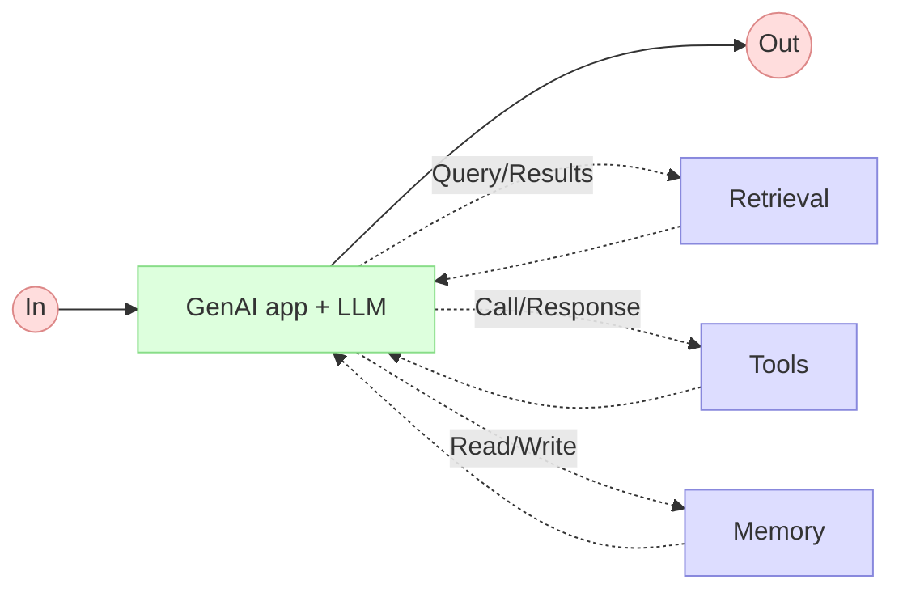

# Application d'IA Générative
## Pattern 1: LLM augmenté
> Augmented LLM

___
[◀️ Previous](../00-intro-agenda/03-btw.md#-vous-pouvez-poser-des-questions-pendant-la-présentation) | [AI Agent ▶️](./05-ai-agent.md#application-dia-générative)
