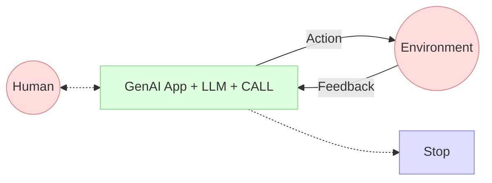

# Application d'IA Générative

## Pattern 2: AI Agent(s) - "Micro" Agent pattern
> "Micro" Agent pattern >> LLM Locaux

## C'est le `"CALL"` qui est important
> ce qui va nous amener à MCP

___
[◀️ Previous](./04-augmented-llm.md#application-dia-générative) | [Prompt ▶️](./06-prompt.md#le-prompt-le-nerf-de-la-guerre)

