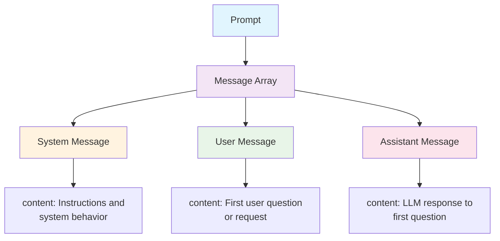
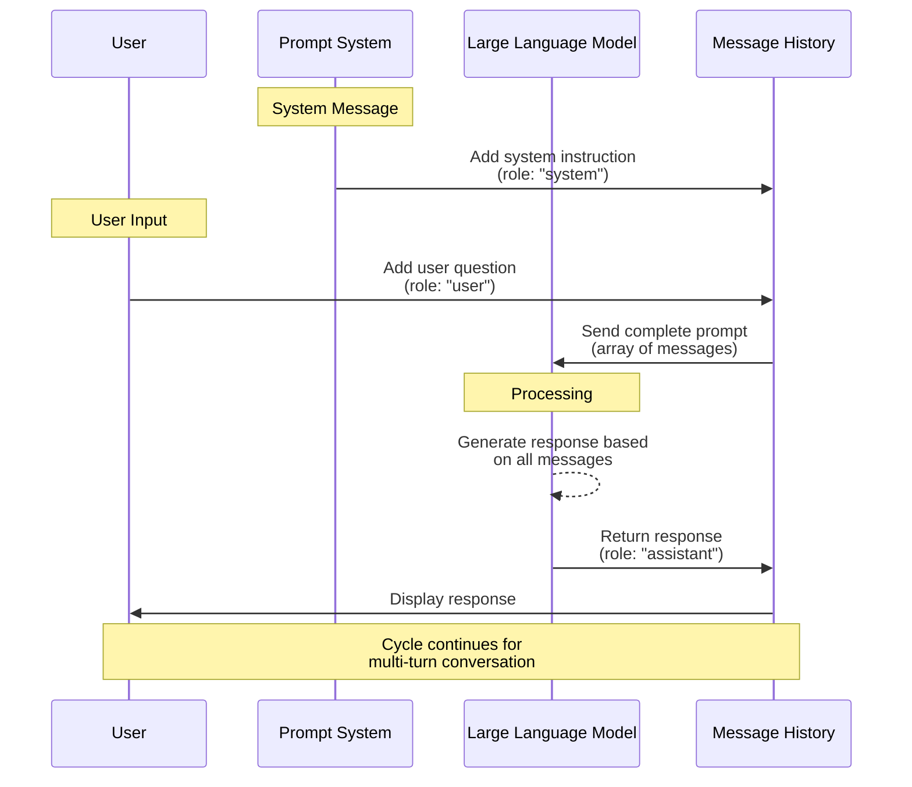

# Le Prompt, le nerf de la guerre

## Messages

```mermaid
graph TD
    A[Prompt] --> B[Message Array]
    
    B --> C[System Message]
    B --> D[User Message]
    B --> E[Assistant Message]

    
    C --> C2["content: Instructions and<br/>system behavior"]
    
    D --> D2["content: First user question<br/>or request"]
    
    E --> E2["content: LLM response to<br/>first question"]
    
    style A fill:#e1f5fe
    style B fill:#f3e5f5
    style C fill:#fff3e0
    style D fill:#e8f5e8
    style E fill:#fce4ec
```

## Conversation

```mermaid
sequenceDiagram
    participant User
    participant System as Prompt System
    participant LLM as Large Language Model
    participant Messages as Message History

    Note over System: System Message
    System->>Messages: Add system instruction<br/>(role: "system")
    
    Note over User: User Input
    User->>Messages: Add user question<br/>(role: "user")
    

    
    Messages->>LLM: Send complete prompt<br/>(array of messages)
    
    Note over LLM: Processing
    LLM-->>LLM: Generate response based<br/>on all messages
    
    LLM->>Messages: Return response<br/>(role: "assistant")
        
    Messages->>User: Display response
    
    Note over User,Messages: Cycle continues for<br/>multi-turn conversation
```

___
[◀️ Previous](./05-ai-agent.md#application-dia-générative) | [1st Agent ▶️](./07-first-agents.md#création-dun-agent)

