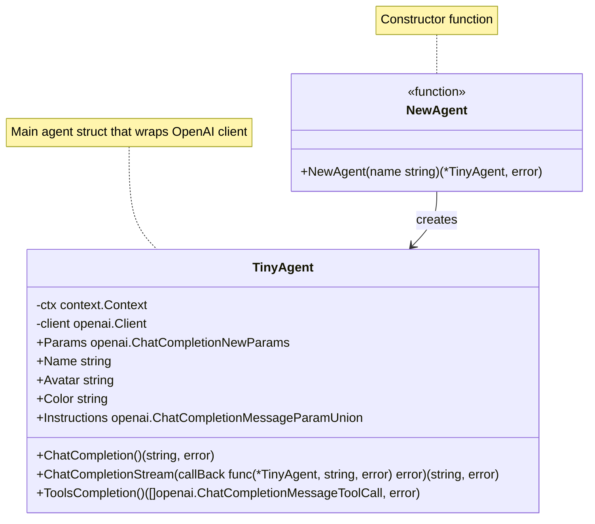

# Création d'un agent

## Structure

## Avec :

### ⦿ OpenAI Golang SDK
### ⦿ 🐳 Docker Model Runner

## 👋 J'ai un bout de code avec 2 agents (futurs agents)...
## ... Alors en fait, ce sont des personnages de D&D 🧝‍♀️
___
[◀️ Previous](./06-prompt.md#le-prompt-le-nerf-de-la-guerre) | [📝 some code ▶️](./main.go)

