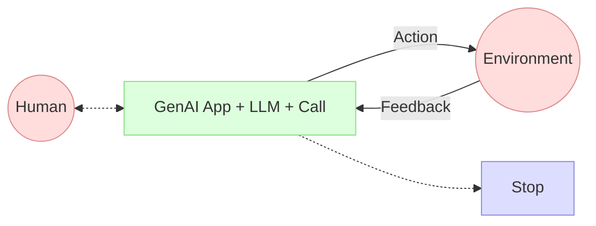

# Application d'IA Générative

## AI Agents - "Micro" Agent pattern
> Micro, c'est de moi ...

> donc ce à quoi l'on souhaite arriver.

## What is a prompt?

## Docker Model Runner

TODO: explain (mac, linux, windows)

## The Heroic Agents
> qui ne sont pas encore des agents...

Imaginons je veux écrire un jeu de rôle

