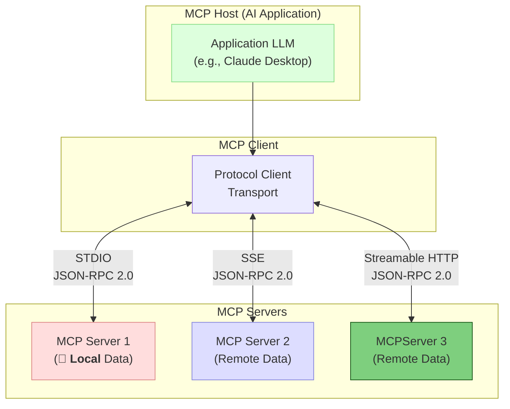

# 🛠️ Model Context Protocol
> le function calling a un niveau supérieur

## MCP (par Anthropic) ?

### Pour le moment le plus **utilisé** est le serveur **`MCP STDIO`** (et ce n'est pas vraiment un serveur)
### **`MCP SSE`** est déprécié
### **`MCP Streamable HTTP`** est arrivé
> on en parlera un peu plus tard

___
[◀️ Previous](./12-we-have-a-problem.md#ok-on-sait-faire-exécuter-du-code-à-un-llm-) | [🎉 MCP ▶️](./14-mcp.md#️-model-context-protocol)