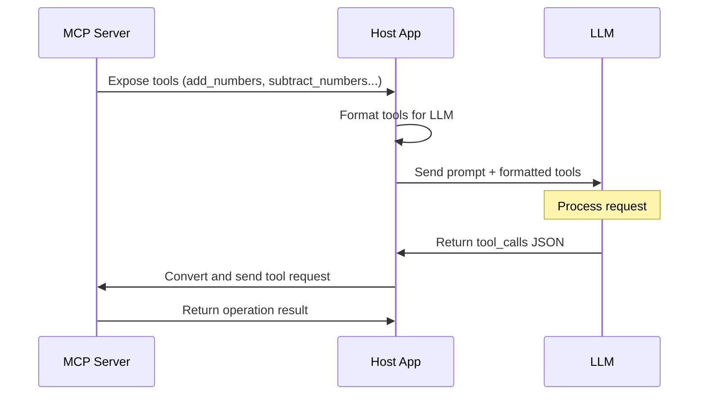

# 🛠️ Model Context Protocol

## Comment ça marche ?

> Le serveur MCP ne se contente pas d'exposer des tools (on en parlera plus tard)

___
[◀️ Previous](./13-mcp.md#️-model-context-protocol) | [📺 STDIO ▶️](./15-stdio.md#fonctionnement-dun-programme-utilisant-stdio)

<!-- TODO: explain

-->