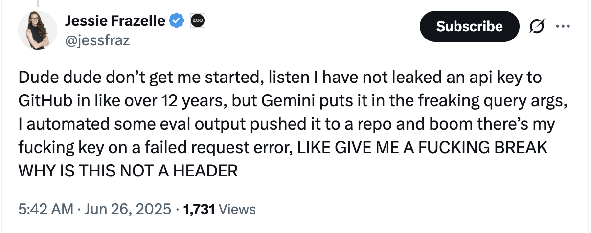

# Perspectives, Conseils & Mises en garde

## MCP c'est bien

- Pratique pour "augmenter" les LLMs
- Streamable HTTP c'est mieux
- Pensez au nommage des tools
- ...

## ☢️ MCP == boîte d'allumettes 🧒

### Exemple: Fuite MCP sur GitHub 

1.	L’attaquant crée une issue malicieuse dans un dépôt public == prompt pour l'agent IA.
2.	L’utilisateur a donné accès à l'agent IA à son compte GitHub, y compris les dépôts privés.
3.	L’agent lit l’issue contenant le prompt injecté, exécute la demande ... et c'est le drame
  - affichage de contenu provenant de dépôts privés dans une PR publique 🙀

### Ouch!

## Garde-fous, quelques mesures

**1. Principe du moindre privilège**
- Limiter strictement les droits d’accès de chaque agent IA

**2. Supervision humaine**
- Mettre en place une supervision humaine pour valider les actions sensibles de l’agent
- Les humains doivent pouvoir intervenir, corriger ou bloquer une action de l’agent en cas de doute

**3. Filtrage et contrôle des sorties**

**4. Isolation du contexte**
- ex : ne jamais permettre à un agent opérant sur un dépôt public d’accéder simultanément à des dépôts privés

**5. Détection automatique et gestion des secrets**

**6. Sensibilisation et formation**

