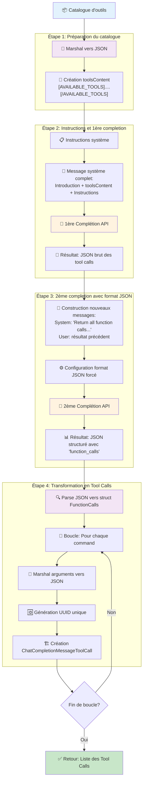

# Et si on améliorait la détection des "tool calls" avec des plus petits modèles ?

## C'était mieux avant




1. Exporter le catalogue d'outils dans une string JSON: 
    ```go
    toolsJson, err := json.Marshal(catalog)
    ```
2. Créer avec cette string JSON, une nouvelle string: 
    ```go
    toolsContent := "[AVAILABLE_TOOLS]" + string(toolsJson) + "[/AVAILABLE_TOOLS]"
    ```
3. Créer des instructions pour expliquer au modèle comment utiliser ce catalogue:
    ```go
    systemContentInstructions := `If the question of the user matched the description of a tool, the tool will be called.
    To call a tool, respond with a JSON object with the following structure: 
    [
        {
            "name": <name of the called tool>,
            "arguments": {
                <name of the argument>: <value of the argument>
            }
        },
    ]

    search the name of the tool in the list of tools with the Name field
    `
    ```
4. Faire une 1ère complétion avec ces instructions système et la question de l'utilisateur
5. Ensuite construire de nouvelles instructions à partir du résultat:
    ```go
    agent.Params.Messages = []openai.ChatCompletionMessageParamUnion{
        openai.SystemMessage("Return all function calls wrapped in a container object with a 'function_calls' key."),
        openai.UserMessage(result),
    }
    ```
6. Faire une 2ème complétion en forçant le format JSON:
    ```go
    agent.Params.ResponseFormat = openai.ChatCompletionNewParamsResponseFormatUnion{
        OfJSONObject: &openai.ResponseFormatJSONObjectParam{
            Type: "json_object",
        },
    }

    completionNext, err := agent.clientEngine.Chat.Completions.New(agent.ctx, agent.Params)
    ```
7. Transformer chaque item du résultat en des messages de type "Tool Call"
    ```go
    for i, command := range commands.FunctionCalls {
        argumentsJson, err := json.Marshal(command.Arguments)
        //...

        toolCalls[i] = openai.ChatCompletionMessageToolCall{
            ID: uuid.New().String(), // Generate a unique ID for the tool call
            Function: openai.ChatCompletionMessageToolCallFunction{
                Name:      command.Name,
                Arguments: string(argumentsJson),
            },
            Type: "function",
        }
    }
    ```

## Et ça fonctionne 🎉